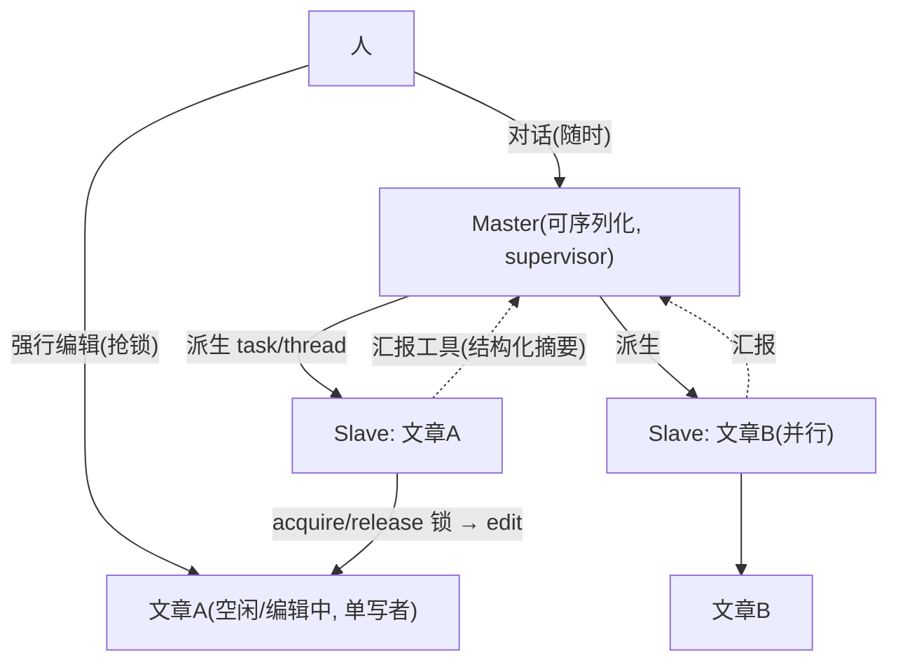
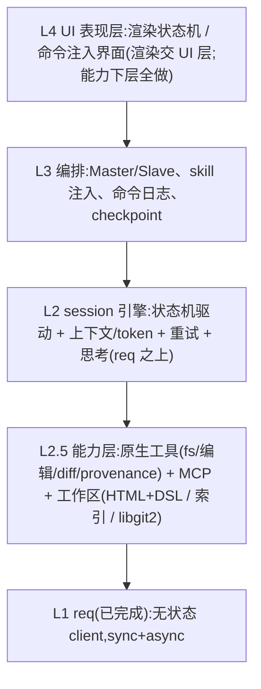

# AI–人协作写作:上层业务讨论稿(draft v2）

> 状态:**讨论稿,供细化**,未动代码。
> 日期:2026-06-18(v2:已并入你的第一轮回复)
> 目的:把 `docs/design.md`(32–44 行)的上层业务想法扩写成可讨论的形态,并**反推 session 层怎么改**。
> 关联:`docs/session-design.md`(被本文大幅推翻)、`docs/req-module-design.md`(底座,不受影响)。
>
> 标注:`【已定】` 你已拍板 / `【整合】` 我据此的综合 / `【新?】` 这一轮新冒出来的问题。

---

## 1. 愿景重述

一句话(你的原话):**基于 DeepSeek 的、AI 和人协作进行写作的一种工作机制,暂不考虑 UI 表现**。

**范围**:不存在"本期不做 / 以后扩展" —— 你想到的能力全部在实现范围内;唯一边界是 UI 的具体渲染交给 UI 层,但其所需的底层能力都要实现。

三条主线(本文按此展开):

1. **协作过程** —— 以**文章(文件)为核心**的状态机;Master/Slave;人可观察、可中断、可直接改。(§2)
2. **工作区与产物** —— 主题=目录、文章=文件、索引定顺序;内部 **HTML + 自研 DSL**(富文本/所见即所得);**字级**溯源;**libgit2** 管历史。(§3)
3. **能力** —— 原生工具(fs / 读写 / 编辑 / diff / find)+ MCP(搜索);**skill = 可复用的对话**(不改系统提示词)。(§4 / §5)

---

## 2. 协作模型(核心)

### 2.1 Master / Slave

【已定】
- 一个**主题** ↔ 一个 **Master**。Master 管该主题的整个生命周期(创建/编辑/删除),是一个**可序列化的 session**。
- **Master 先于主题存在**;主题被删,Master 也消亡。
- Master 可**派生子 session(Slave)** 做具体活,例如**并行写多篇文章**。
- **写一篇文章 = 查资料 → 写 → 改 的大循环**,直到写完。
- **人对主题只有两种交互**:① 随时和 Master 对话;② **直接改文章内容**。

### 2.2 文章 = 可锁资源(两态,不是复杂状态机)

【已定】文章只有两态:**空闲 / 编辑中**,用**文件锁**实现。之前那套 `Created/Drafting/…/Settled` 太复杂,废弃;**没有"定稿"态**,写完即释放锁、回到空闲。

- **AI 主动持 / 放锁**:通过**主题管理工具** acquire / release 文章锁;**持锁者 = 当前唯一写者**(单写者不变量)。
- **人可强行编辑(抢锁)**:用于异常情况。**锁被抢后,AI 自己判断后续** —— 把"锁被抢 / 文章已被人改"当作一次 observation 喂回 LLM,由它决定:重读文章 → 继续 / 放弃 / 换策略。
- "修改窗口" = 持锁期间;不持锁的阶段(如查资料)不能改文章。

> 【参考·流行 agent 实践】这是标准的"环境反馈驱动":AI 不假设独占,环境(锁 / 文件)变了就作为 observation 反馈,Agent 自适应 —— 比预先堆一堆状态更鲁棒。

### 2.3 Slave:单篇文章的写作循环

【已定】Slave 是 Master 派生的子任务,**实现上 = 一个 task(tokio,async)或 thread(同步)**,去写一篇文章。

- **循环 = 查资料 → 写 → 改**(ReAct 式:推理 → 调工具 → 观察 → 再推理),直到 LLM 自评写完。
- 复用 req 的回合:组装上下文 → 调 req → 按 `finish_reason` 分支(工具 / 继续 / 结束)。
- **改文章前 acquire 锁,改完 release**;查资料阶段不持锁。
- **"够不够 / 好不好" 由 LLM 自评**(自己决定继续查 / 继续改 / 收尾);人可随时用命令干预。

### 2.4 Master ↔ Slave:监督者模式

【已定 + 整合】
- **Master 不直接看 Slave 的全部执行日志**(会污染 Master 上下文)。Slave 通过**汇报工具**主动上报**结构化摘要**(进展 / 结果 / 需要),而非流水账。
- **Slave 仍记完整操作日志作 fallback**:Slave 出问题时,Master 调取并分析,决定 **重启 / 终止 / 改派** —— supervisor 模式(类 actor supervision)。
- **并发**:多 Slave 并行写**不同**文章天然无冲突(各持各的文章锁);**同一文章同一时刻单写者**由锁保证。

> 【参考·流行 agent 实践】"子代理只回摘要、不回完整 transcript"正是主流多代理编排的做法(这套环境里的 Agent 子代理也是只返回最终结论);Master 像 supervisor 树:监督、按需重启 / 改派。

### 2.5 命令 与 撤销

【已定】
- **命令 = 人能做的一个原子操作**(一次内容编辑、一次按钮点击 / 意图……),按序记入**命令日志** —— "可观测"与"重放"的来源。
- **撤销 = 文章编辑级 undo**(像编辑器撤销栈),**不是**整 session 快照回滚。文章的编辑链(provenance + libgit2,见 §3)天然支撑它。
- **Master 的"可序列化"**用于**持久化 / 恢复**(关掉主题再打开复原现场),和"撤销"是两件不同的事。

### 2.6 这一层剩下的问题

【新?】
1. **抢锁时序**:Slave 正处于一轮 req 中途时,人的强编辑是**排到回合边界**落(锁在边界处被抢),还是硬打断当前回合?(倾向:排到回合边界。)
2. **Master 并发度**:同时最多派几个 Slave?Slave 写完结果怎么并回**主题索引**(§3)?
3. **Master 状态机**现在细化,还是先把 Slave 单文章循环跑通再补?(倾向:先跑通 Slave。)
4. **汇报工具 / 操作日志**最小字段:Slave 上报哪些结构化信息够 Master 决策?

---

## 3. 工作区 / 产物模型

【已定】
- 两层:**主题(目录)→ 文章(文件)**;主题下索引定**阅读顺序**(目录树)。
- **溯源细到字**:AI 编辑 vs 人编辑的内容要区分到**文本块 / 字符**级。不能简化。
- **格式**:**HTML 作为底层实现**,在其上**自研一套 DSL** 实现富文本"所见即所得"——这本身很复杂,但**不简化**。(纠正了我之前"markdown 为内部源"的提法。)
- **版本 / 历史**:用 **git,但走 libgit2(库),不是 CLI 工具**。
- **并发编辑 / 文件锁 ≠ git**,是另一件事,单独处理。

【整合】
- 内部内容模型 = **DSL 文档树**(渲染成 HTML),每个文本块/字符携带**作者标记(model id / 人)**——溯源就活在这棵树里。
- 署名 = 从字级作者**聚合**:文件头(frontmatter 或 DSL meta)记"参与过的 model id 集合 + 人工签名"。
- libgit2:每次"采纳的修改"= 一个 commit(作者写进 trailer),给历史/回退/diff 一个底座。**注意**:git 的行级 diff 对富文本树不够,字级溯源得在 DSL 层自己维护(git 只兜文件级历史)。

【新?】
1. **DSL 要表达什么**:富文本结构 + **字级作者标记** + 可能的"来源引用"。它同时是**编辑格式**和**溯源载体**吗?先定它的最小能力集。
2. **字级溯源怎么存**:DSL 里内联标记(span 带 author)还是平行的"作者映射表"?编辑时怎么原子地更新它?
3. **diff 在富文本上怎么做**:DSL 树 diff / 字级 diff?这关系到"AI 出修改"和"人改"如何统一表示。
4. **libgit2 与字级溯源的边界**:git 兜文件级版本,字级作者在 DSL 层 —— 两者怎么对齐(一个 commit ↔ 一批字级作者变更)?
5. **并发**:多个 Slave 并行写**不同**文章天然无冲突;**同一文章**会不会被 Master+Slave 或多 Slave 同时碰?(并发模型见 §2/§4)

---

## 4. 工具(能力层)

【已定】
- **原生工具自保安全**:工具自身要保证基本安全,比如**禁止删系统文件**等(不是靠上层兜)。
- **大文件 / 二进制**:基于 DeepSeek API 的限制**直接做保护 + fallback + 甚至报错**,然后**把问题抛回给 LLM 让它判断怎么解决**。
- 搜索走 **MCP**(第三方);其余(fs / 读写 / 编辑 / diff / find)原生实现。

【整合】这里有一条很干净的分工,正好支撑"自洽":
- **确定性护栏在工具层**:沙箱到工作区、禁删系统文件、大小/类型限制 —— 工具**拒绝**越界操作。
- **自适应恢复在 LLM**:工具拒绝/报错(如文件过大)→ 作为 `tool` 结果**抛回**给 LLM,由它换策略(分块读、摘要、改用别的工具)。
- 工具按**角色**分:Master 用"主题/文章生命周期 + 派生 Slave + 索引",Slave 用"查资料 + 读写 + 编辑 + diff"。

【新?】
1. **编辑工具的契约**:AI 的 `edit` 和人的"直接改"**是否走同一条 provenance 感知的编辑原语**(只差 author 标记)?若不是,字级溯源会分叉。**(自洽关键)**
2. **工具受状态机约束**:`edit` 只在文章处于"修改窗口"时有效 —— 越窗编辑工具直接拒绝(AI 收到拒绝 → 自行调整)。这个 gating 谁来管?
3. **Master/Slave 工具集**具体怎么切?同一文章是否限定"同一时刻只有一个写者"?
4. 工具结果回灌:走 req 的 `tool` 消息(`tool_call_id` + content);超长结果(搜索/大文件)如何截断或改成"引用 + 按需取"?

---

## 5. skill

【已定】
- **两种作用域**:全局 / 仅主题(theme-only)。
- **两种激活**:自动加载 / 手动调用。
- **skill 不改系统提示词** —— 它**本身只是一段普通对话**。
- **暂不考虑缓存命中省钱**,实现优先。

【整合·重要】这条把之前最大的一个误判纠正了:
- 我原来以为 skill 会**动态改写系统提示词**,于是判定 session 的"固定系统提示词"假设被推翻。**错了。**
- skill 既然只是"普通对话"(往会话里注入一段消息 / 一轮 prompt),那么**系统提示词可以保持固定**,`session-design.md` 的 S2/S10 **不需要改**。
- skill ≈ 预置的对话片段(可能附带建议用的工具),按作用域(全局/主题)和激活方式(自动/手动)注入到 Master/Slave 的对话流里。

【新?】
1. skill 注入成哪种角色:`user` 消息?`assistant` 预填?还是一类"系统旁白"?
2. **自动加载的触发**:打开主题就挂载(theme skill)?进入某文章状态就挂载?
3. skill 是否绑定工具/约束,还是纯文本?存储:`skills/*`(全局)+ `主题/skills/*`(主题内)?
4. 手动调用的入口:人通过命令触发,还是 AI 也能"调用某 skill"(那它就近似一次工具调用)?

---

## 6. 分层架构(更新)

- **L1 req** —— 不动。
- **L2 session 引擎** —— 从"自治 worker"改成"**状态机驱动的回合执行器**":一次回合仍是"组装上下文 → 调 req → 按 finish_reason 分支 → 工具",但**由状态机决定何时能改文件、何时停下等命令**。
- **L2.5 能力 / 工作区** —— 原生工具 + provenance 编辑原语 + DSL 文档模型 + libgit2 + 索引。
- **L3 编排** —— Master/Slave 调度、skill 注入、命令日志、checkpoint/回退。
- **L4 UI** —— 渲染与人交互,非本代码;但 L2/L3 必须把状态、命令注入、可中断点做出来。

【新?】crate 切分:`req`(已完成)/ `workspace`(DSL+provenance+libgit2+索引)/ `tools` / `engine`(状态机+回合)/ `orchestration`(master/slave+skill)。先合一个 harness crate 迭代,还是直接拆?**倾向**:先把 `workspace` 的 DSL/provenance 模型和"回合执行器"两条脊柱定死,边界随后自然浮现。

---

## 7. 对 session-design.md 的反推(更新)

| session-design.md | 上一版结论 | **v2 修正** |
|---|---|---|
| S2 / S10 固定系统提示词 | 要改成可变 | **不改了** —— skill 只是对话,系统提示词保持固定 |
| §3 流程 / §8 Outcome | 事件流 + 检查点 | **状态机驱动** + 命令注入 + checkpoint;Outcome 仍是终态,但 session 分 **Master / Slave** 两类 |
| §3 MAX 20 轮 | 人介入轮不算自动轮 | 仍成立;且"修改窗口/命令"是更自然的暂停点 |
| §5 工具重试 | 占位 | 工具层自保安全 + 大文件 fallback 抛回 LLM(§4) |
| §6 上下文 / 压缩 | 结合索引选材 | 不变:按索引选相关文章组装,不做有损摘要 |
| 新增 | — | **provenance 编辑原语**、**文章/Master 状态机**、**命令日志/回退** 是 session 引擎的新内核 |

【整合】`session-design.md` 现在要重写成**两层**:Slave = 单文章的"查资料→写→改"回合执行器(最接近原 worker);Master = 主题级状态机 + 调度。等本文 §2–§5 的 `【新?】` 收敛,再一次性重写。

---

## 8. 本轮新问题(按优先级)

要先答上面、才能往下定的:

1. ~~AI 改文章:直接落 vs 提案待批~~ → **已定:直接落地**(§2.4)。
2. **文章状态机的状态集 + 修改窗口**(§2.3-1)。
3. **统一编辑原语**:AI `edit` 和人"直接改"是否同一条 provenance 感知原语(§4-1)。**自洽关键。**
4. **DSL 最小能力集 + 字级溯源存法**(§3-1、§3-2)。
5. **同一文章的写者并发**:是否"同一时刻单写者"(§3-5、§4-3)。
6. **Master↔Slave 协议 + 命令/checkpoint 粒度**(§2.3-2/3/4)。
7. skill 注入角色与自动加载触发(§5)。

---

## 9. 工具逻辑自洽性检查(讨论焦点)

把上面的决定摆在一起看,工具层要**自洽**,我认为必须同时满足下面几条;每条后面是潜在张力:

1. **单一编辑原语,按 author 打标**:AI 的 `edit` 工具 和 人的"直接改"**走同一条 provenance 感知原语**,只差 `author = model-id | 人`。否则字级溯源(§3)会从两条路分叉、对不上。
   - 张力:人"直接改"走 UI,AI 改走 tool-call,二者最终**必须汇到同一个写入原语**。

2. **编辑被状态机门控**:任何编辑(AI/人)只在文章处于"**修改窗口**"才允许。越窗:AI 收到工具拒绝 → 自行调整;人被 UI 拦或排队。
   - 张力:"和 Master 对话随时可做" vs "改文章受窗口限制" —— 两类命令的时序得分清。

3. **【已定】乐观直接落地**:`edit` 工具 = "写入 + 记 provenance",人靠**回退**纠错;不走"提案待批"。工具契约由此定死。

4. **同一文章单写者**:Slave 写文章 A 时,Master / 另一个 Slave / 人**能否同时写 A**?若允许 → 需要并发/锁(§3 说和 git 无关,是独立机制);若"单写者" → 工具层用文章状态/租约保证,简单很多。
   - 我倾向**同一文章同一时刻单写者**(写者=当前持有修改窗口的那个),人介入时先"夺取"窗口。

5. **护栏 in 工具 / 恢复 in LLM**(你已定):工具做确定性拒绝(沙箱、禁删系统文件、大小限制),LLM 做自适应恢复。这条本身自洽,且边界清晰 —— 工具**永不**因为 LLM "说要"就越界。

6. **研究→编辑的衔接**:MCP 搜索产出的是**素材**,不是正文;它经由一次 **AI 编辑**(author=AI,可带来源引用)才进入文章。即"搜索结果"不直接落盘,而是触发 §9-1 的编辑原语。

> 结论:**#3 已定 = 乐观直接落地**(回退兜底)。工具自洽于是只剩 **#1 单一编辑原语 / #2 状态机门控 / #4 单写者** 三条工程不变量,实现时保证即可,链条闭合。

---

## 附:不变的地基

- `req` module(无状态、sync+async、错误模型、SSE、usage)—— 直接复用。
- 思考模式规则、`finish_reason` 分支、`is_transient` 重试分流 —— 仍是 session 引擎内核,被状态机包一层。
- **新认知**:`session-design.md` 的"固定系统提示词"在 v2 里**保留**(skill 不改它)。
