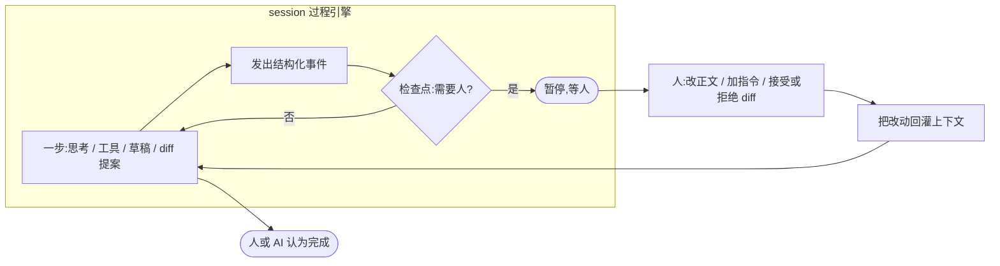
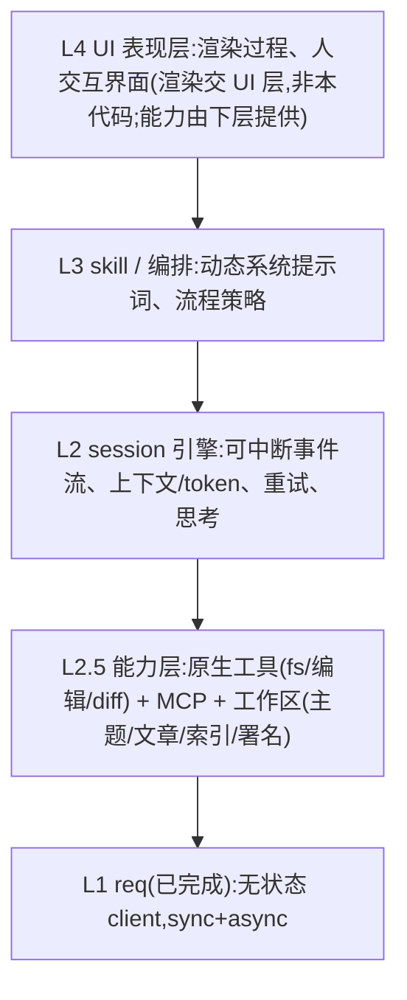

# AI–人协作写作:上层业务讨论稿(draft）

> 状态:**讨论稿,供细化**,未动代码。
> 日期:2026-06-18
> 目的:把 `docs/design.md`(32–44 行)的上层业务想法扩写成可讨论的形态,并**反推 session 层需要怎么改**。
> 关联:`docs/session-design.md`(会被本文推翻一部分假设)、`docs/req-module-design.md`(底座,不受影响)。
>
> 标注:`【你的原意】` 忠实复述 / `【扩写】` 我的展开 / `【倾向】` 我的建议 / `【?】` 待你拍的开放问题。

---

## 1. 愿景重述

【你的原意】一句话:**基于 DeepSeek 的、AI 和人协作进行写作的一种工作机制,暂不考虑 UI 表现**。

【范围·更正】**不存在"本期不做 / 以后扩展"的部分** —— 你目前想到的能力(协作机制、工具、skill、工作区、多格式、署名……)**全部在实现范围内**。唯一边界是 **UI 的具体表现 / 渲染**交给 UI 层(你明确暂不考虑表现);但**支撑它的底层能力**(事件流、可中断、人介入、diff 协作)同样要实现,不是预留的扩展点。

【扩写】我把它拆成三条主线,后面分别展开:

1. **协作过程**:写作不是"给 AI 一个题目然后等它做完一切",必须有参与感 —— 过程清晰、可视化(UI 层)、人可随时介入和修改(底层要提供这个能力)。← **最关键,直接重塑 session**。
2. **工作区与产物**:主题=目录、文章=文件、索引定阅读顺序;支持纯文本/markdown/html→pdf;每个文件带 AI(DeepSeek model id)+ 人的署名。
3. **能力**:原生代码实现的工具(文件管理、文本读/写/编辑/diff/find)+ 第三方 MCP(搜索);skill 配置 + 系统提示词动态插入/修改。

---

## 2. 协作模型(核心,反推 session)

【你的原意】过程要清晰、可视化、人可修改;不能一锤子交付。

【扩写】这条和当前 `session-design.md` 的根本假设冲突 —— 那份设计里 session 是"自动跑到 `stop` 或撞 20 轮,返回单一 `Outcome`"的**自治 worker**。协作写作要的不是这个,而是一个:

> **可观察、可暂停、人可介入和修改、可续跑的"过程引擎"。**

具体含义:

- **过程要"流"出来**:每一步(思考 / 工具调用 / 草稿增量 / diff 提案)作为**结构化事件**对外发出,底层只负责产生事件,UI 负责渲染。
- **人可以在步骤之间介入**:修改正文、追加/纠偏指令、否决某一步的产出。session 要能**在检查点暂停、吸收人的改动、再续跑**。
- **"编辑 / diff"是协作的核心动作**:AI 不直接覆盖正文,而是产出**改动提案(diff)**,人 review → 接受 / 改 / 拒,再回灌进上下文。本质是"写作版的 code review"。

【倾向】底层做成**"可中断的事件流引擎"**,把"全自动 vs 步进"留给上层(编排/UI)决定 —— 引擎只保证:每步可观测、任意检查点可停可续、人的改动能回灌。

【?】协作粒度怎么定:
- (A) 事件流 + 检查点:session 自主跑,每步发事件,可在检查点停下等人。
- (B) 步进式:把循环拆成离散"动作",人逐个触发/批准。
- (C) 双模:可全自动也可步进,都带 checkpoint。

我倾向 A/C 混合。你怎么看协作的默认颗粒度?

---

## 3. 工作区 / 产物模型

【你的原意】组织两层:**主题(目录)→ 文章(文件)**;主题下文章按**阅读顺序**(目录树),用主题下的**索引**支持关系;多格式(纯文本/markdown/html→pdf);版权 AI+人共有,每文件带**署名(deepseek model id + 人工签名)**。

【扩写】

- **工作区 = 一棵目录树**:`主题/` 目录 + 其下 `文章` 文件 + 一个**索引文件**(每主题一个 manifest,定义文章顺序与每篇元数据:状态、署名、格式)。所有工具都围绕这棵树操作。
- **格式**【倾向】:以 **markdown 为内部规范源**(AI/人都好编辑、diff 友好),html/pdf 作为**导出产物**(派生,不作为编辑源)。
- **署名 / 溯源**:model id 正好来自 req 的 `ChatResponse.model`(我们特意保留成 `String`)。【倾向】署名放文件 **frontmatter**(markdown 头部)或 sidecar 元数据。
- 【?】溯源粒度:只在**文件级**记 "AI+人 共著",还是要**段落/区块级**标注"哪段是 AI、哪段是人"?后者更贴合"参与感/可改",但实现复杂(要跟编辑/diff 记录绑定)。
- 【?】版本与历史:用 **git** 管工作区,还是自管快照?并发编辑 / 文件锁要不要管?

---

## 4. 工具(能力层)

【你的原意】代码直接实现:文件管理(创建/修改/删除文件夹等)、文本编辑(读/写/编辑/diff/find);搜索走第三方 MCP。工具要做 helper,虽然贴近 MCP 的 tool,但抽一层方便扩展(规则 7)。

【扩写】

- **两类工具,统一抽象**:**原生**(fs 管理、文本读/写/编辑/diff/find,直接代码实现)+ **MCP**(搜索等外部服务)。session 只看到"工具",由能力层 dispatch 到原生实现或 MCP。
- **`edit`/`diff` 是协作核心**(见 §2):AI 产出 diff 提案而非直接覆写,人 review 后落盘。`find` 支撑跨文章检索/索引。
- 【倾向·安全】文件删除/覆盖是破坏性操作。你说安全不在 req 层 —— 但工具层在 harness,**破坏性操作建议本层做最小防护**:diff 预览、dry-run、软删除/回收,而不是直接 `rm`。
- 【?】工具结果如何回灌:走 req 的 `tool` 消息(`tool_call_id` + content)。大文件 / 二进制 / 超长检索结果怎么截断或引用?

---

## 5. skill / 动态系统提示词

【你的原意】支持 skill 配置;系统提示词**动态插入、修改**。

【扩写】

- **skill = 可复用的能力包**:一段系统提示词片段 + 可能绑定的工具子集 / 约束 / 输出规范。例如"小说设定 skill""学术引用 skill""润色 skill"。
- **动态组装**:运行时按任务 / 阶段把若干 skill 的提示词**拼进系统提示词**,且可中途增删改。
- 【冲突】这直接推翻 `session-design.md` 的 **S2/S10「一次性固定系统提示词」**:系统提示词不再是创建时定死,而是**会话期内可变**。session 要把"当前生效的系统提示词"作为**可变状态**管理。
- 【?】skill 的存储与粒度:文件(`skills/*.md`)还是配置?激活方式:**人手选** / **AI 按需自选**(后者又是一类工具调用)/ 阶段自动挂载?
- 【?】skill 改了系统提示词 → 上下文里**前缀变了 → 缓存命中下降**(req 调研里硬盘缓存按前缀)。要不要把"稳定 skill"前置、"易变指令"后置以保命中?

---

## 6. 分层架构(把以上落到层)

【扩写】我把它分成自下而上几层,标出归属:

- **L1 `req`** —— 已完成,lib crate 内的 `req` module,不动。
- **L2 session 引擎** —— 按 §2/§5 **重构**:从"自治 worker→单一 Outcome"改成"可中断事件流 + 可变系统提示词 + 人介入回灌"。
- **L2.5 能力层 / 工作区** —— 原生工具、MCP 桥接、project 模型(主题/文章/索引/署名)。
- **L3 编排 / skill** —— 动态组装系统提示词、决定自动还是步进。
- **L4 UI 表现层** —— 具体渲染 / 界面交给 UI 层(不是这套代码),但 L2 的事件流与人介入能力**必须完整实现**来支撑它,不是占位。

【?】crate 切分:`req` 在 lib;session / 工具+工作区 / 编排 各自独立 crate,还是先合在一个 harness crate 里迭代?

---

## 7. 对 session-design.md 的反推(明确要改的)

| session-design.md | 现状假设 | 上层业务要求 | 怎么改 |
|---|---|---|---|
| S2 / S10 | 系统提示词**一次性固定** | skill 动态插入/修改 | 系统提示词变**可变状态**;每轮重组(注意缓存前缀) |
| §3 流程 / §8 Outcome | 自治循环 → 单一 `Outcome` | 可观察、可暂停、人可改 | 改成**事件流 + 检查点 + 人介入回灌**;`Outcome` 退化为"终态事件" |
| §3 「MAX 20 轮兜底」 | 纯自动轮次上限 | 人会介入 | 人介入的轮不应算自动轮;自动段才计数 |
| §5 工具重试 | 占位 | edit/diff 协作 + 破坏性防护 | 工具层补 diff 预览 / 软删除(§4) |
| §6 上下文 | token 统计 + 压缩待定 | 多文章长上下文 + 索引 | 压缩策略要结合"工作区/索引"(可只带相关文章,而非全量) |

【倾向】不要急着改 `session-design.md` —— 先在本讨论稿里把"事件流引擎 + 可变系统提示词 + 工作区"三件事拍定,再一次性重写 session 设计,避免来回 diff。

---

## 8. 开放问题清单(驱动细化)

按优先级,先答上面的决定下面:

1. **协作颗粒度**(§2):默认全自动 + 检查点,还是步进?引擎对外发哪些事件类型?
2. **系统提示词可变性**(§5):skill 怎么存、谁激活(人/AI/阶段)、改写时怎么保缓存命中?
3. **工作区模型**(§3):索引文件用什么格式;溯源做文件级还是段落级;用不用 git 管历史。
4. **协作的"改动单位"**(§2/§4):是不是统一走 diff 提案 → 人 review → 落盘?谁是正文的"真相源"(文件 vs 上下文)?
5. **压缩 × 工作区**(§6):长写作时上下文带"全部历史"还是"按索引带相关文章"?
6. **crate 切分**(§6):一个 harness crate 起步,还是直接拆 session / 工具 / 编排?
7. **版权/署名落地**(§3):frontmatter 字段长什么样;model id 多模型混用时怎么记。

---

## 附:不变的地基

不管上层怎么变,下面这些已定且不受影响:
- `req` module(无状态、sync+async、错误模型、SSE、usage)—— 直接复用。
- 思考模式规则(剥 `reasoning_content`、`max_tokens` 给足)、`finish_reason` 分支、`is_transient` 重试分流 —— 仍是 session 引擎的内核,只是被"事件流 + 人介入"包了一层。

