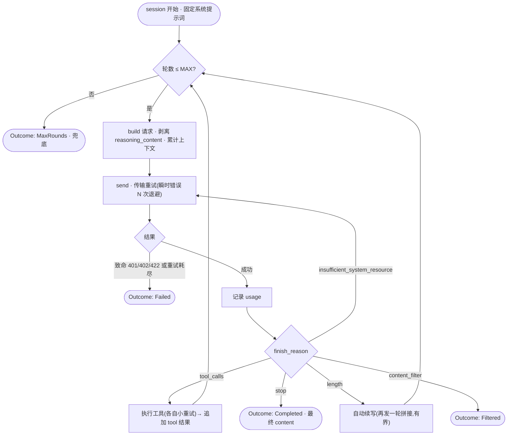

# session / worker 层设计(草案 · 待 review）

> 状态:**草案,待 review**,未动代码。
> 日期:2026-06-17
> 定位:`req` module **之上**的 worker / session 层(harness),消费 `req::Client`。
> 上游:`docs/design.md`(原始思考 + 流程)、`docs/req-module-design.md`(底层无状态 wrapper)。

---

## 0. 决策速查表

| # | 决策 | 选择 | 理由 |
|---|---|---|---|
| S1 | 定位 | **req 之上的独立一层(harness)**,不进 req crate | req 保持无状态;有状态的都在这层 |
| S2 | session = worker | **固定系统提示词,处理用户一条请求,跑 agentic 循环直到产出最终响应** | 规则 13 |
| S3 | 最终响应 | **= LLM 自然终止(`finish_reason=stop`)时最后的 assistant `content`**,不另发归纳请求 | 用户澄清 |
| S4 | 重试是三个独立循环 | 传输重试 / agentic 轮次(MAX)/ 工具重试,各自计数与策略 | 语义不同,不能混 |
| S5 | 分支依据 | **`finish_reason`(6 种)**,而非二元 tool/end | 覆盖 length/filter 等 |
| S6 | 重试分流 | 只重试**瞬时错误**(`Error::is_transient`);致命(401/402/422)快速失败 | 别在 bad key 上烧 20 轮 |
| S7 | `length` 截断 | **自动续写**(机制实现时定,需有界) | 用户拍板 |
| S8 | 上下文统计 | 用响应**真实 `usage`** 累计,不写估算函数 | 规则 9 |
| S9 | 压缩 | **v1 暂不做,保留全量上下文**(策略后续再定) | 用户拍板 |
| S10 | 思考模式 | **session 级开关**;每轮剥 `reasoning_content`;`max_tokens` 给足 | 规则 12 + req 实测 |
| S11 | 产出类型 | `Outcome` 枚举:`Completed` / `MaxRounds` / `Filtered` / `Failed` | 取代笼统"总结/兜底" |
| S12 | 轮次上限 | `MAX`(暂定 20)兜底,防失控 | 用户流程 |

---

## 1. 定位与边界

- **在 `req` module 之上**,消费 `req::Client`(sync 或 async)+ 其类型。
- 是**独立 crate(harness)**,不污染 `req`。
- **本层做**:上下文管理、agentic 循环编排、重试编排、token 统计、思考开关。
- **本层不做**:安全、限速(沿用之前划分)、上下文压缩策略(S9 暂缓)。

`req` 是"一次调用一次 HTTP"的无状态底座;session 把**有状态**的部分(历史、统计、循环)收在这里——正是 req 设计里 park 掉的那部分。

---

## 2. 核心概念:session = worker

- **一次性系统提示词**:创建 session 时固定。
- **输入**:用户的一条 prompt(任务)。
- **过程**:agentic 循环,期间可调用工具。
- **输出**:一条最终响应(`Outcome`)。

一个 session 处理一条用户请求,跑到 LLM 自然终止或撞到兜底为止。

---

## 3. 执行流程(refined)



### 三个独立循环(别混)
- **传输重试**(围绕 `send`):只对瞬时错误(5xx / 超时 / 断连)重试,小 `N` + 退避。
- **agentic 轮次循环**(`R`):每个工具轮 / 续写轮 +1,到 `MAX` 兜底。**`MAX` 管的是这个**。
- **工具重试**(`T` 内部):单个工具失败的小重试。

---

## 4. finish_reason 处理表

| `finish_reason` | 动作 |
|---|---|
| `tool_calls` | 执行工具 → 追加 `tool` 结果 → 进入下一轮 |
| `stop` | 终止 → `Completed`(最终 `content`) |
| `length` | **自动续写**(再发一轮拼接,有界)→ 下一轮 |
| `content_filter` | 中止 → `Filtered`(不可重试) |
| `insufficient_system_resource` | 当瞬时错误 → 传输重试 |
| `unknown(...)` | 保守处理(待定:当终止 / 上报) |

---

## 5. 重试策略(对应三循环)

| 循环 | 触发 | 策略 | 耗尽时 |
|---|---|---|---|
| 传输重试 | `Error::is_transient()`(5xx/超时/断连)、`insufficient_system_resource` | 小 `N` 次 + 指数退避 | → `Failed` |
| 致命错误 | 401/402/422/400 等 | **不重试** | 立即 `Failed` |
| agentic 轮次 | 工具轮 / 续写轮 | 每轮 +1 | 到 `MAX` → `MaxRounds`(兜底) |
| 工具重试 | 单工具执行失败 | 小 `N` 次 | 待定(中止该工具 / 整体失败) |

> 关键:别用一个计数器套所有失败。"重试 20 次退出"这种把 HTTP 重试和 agentic 轮次混在一起的写法要拆开。

---

## 6. 上下文与 token

- 每轮从响应 `usage` **累计**:`prompt_tokens` / `completion_tokens` / `total_tokens` / `prompt_cache_hit/miss` / `reasoning_tokens`。
- 两个不同的限制:
  - **单次输出** `max_tokens`(撞上 → `length` → 续写);
  - **上下文窗口**(V4 为 1M)。
- **v1 不压缩,保留全量上下文**(S9)。接近上限的处理目前**仅靠 `MAX` 轮次间接限制**;真撞上下文上限会由服务端报错(走 `Failed`)。压缩策略后续单独设计。
- **不写估算函数**(S8):压缩 / 水位判断都基于上一次响应的真实 `usage`,而非发送前估算。

---

## 7. 思考模式

- **session 级开关**(S10):创建时定,整个 session 一致。
- 每轮把 assistant 回填进历史时**剥掉 `reasoning_content`**——直接用 `req::RespMessage::to_history()`(否则下一轮 400)。
- 思考链吃 `max_tokens` 预算,要给足;出现 `content` 空 + `finish_reason=length` 即"被思考链截断",走自动续写。

---

## 8. 产出 Outcome

```rust
enum Outcome {
    Completed { content: String, usage: UsageTotals },   // stop:最终响应
    MaxRounds { partial: String,  usage: UsageTotals },   // 撞 MAX 兜底
    Filtered  { usage: UsageTotals },                     // content_filter
    Failed    { error: req::Error, usage: UsageTotals },  // 致命 / 重试耗尽
}
```

- `UsageTotals` 是 session 内对各轮 `req::Usage` 的累加(本层维护)。
- "总结 / 兜底收尾"不再是模糊动作,都落到某个 `Outcome`。

---

## 9. 待定 / 后续(明确暂缓)

1. **压缩策略**(S9):保留全量 vs 摘要旧轮次(有损,写作场景慎用)vs 滑动窗口。
2. **`length` 自动续写**的具体机制(prefix 续写?拼接?)+ 续写轮的独立上界。
3. **`unknown` finish_reason** 的处理。
4. **工具重试耗尽**的策略(中止该工具 / 整体失败)。
5. **多个 `tool_calls`** 的并行 / 串行执行。
6. session 是否要支持流式产出(`chat_stream`)给上层,还是只给最终 `Outcome`。

---

## 附:与 req module 的衔接

session 直接复用 req 的:
- `req::Client` / `req::blocking::Client`(`chat` / `chat_stream`)
- `ChatRequest::builder` + `Thinking` + `tools`
- `FinishReason`(驱动 §4 分支)、`Usage`(驱动 §6 统计)
- `Error::is_transient()`(驱动 §5 重试分流)
- `RespMessage::to_history()`(驱动 §7 剥离 reasoning_content)

req 把"无状态 + 类型化 + 友好错误 + SSE 清洗"做扎实,session 在其上只编排状态与循环,不重复造轮子。


